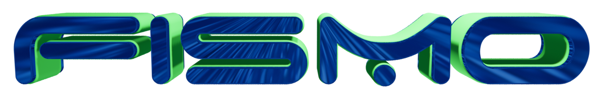
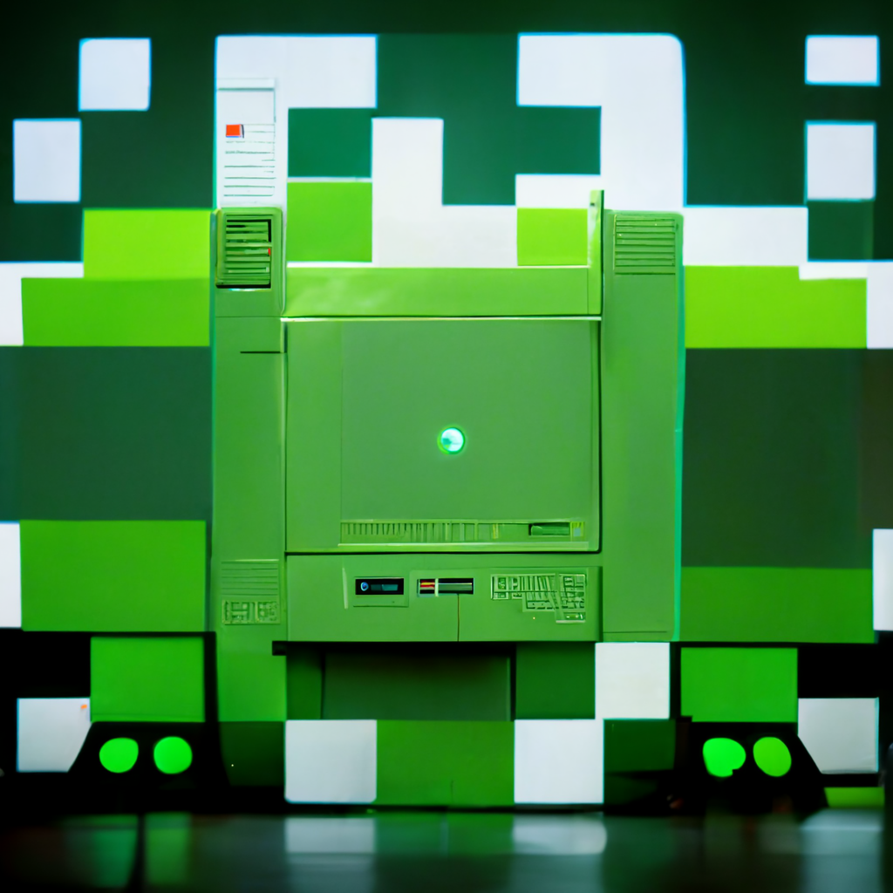
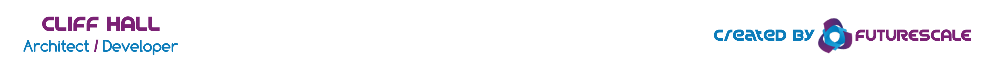

# The Finite State Machine Protocol for EVM Blockchains
Fismo Machines are a way of simulating stateful things, processes, or maps of places.

## 📖 [Documentation](https://docs.fismo.xyz)
## 📋 Status
###  🔬 

Done or in progress are:
- ✅ Science! a functional [Deterministic Selector Proxy](docs/whitepaper.md#deterministic-selector-proxy) implementation
- ✅ A robust [Finite State Machine](https://en.wikipedia.org/wiki/Finite-state_machine) protocol
- ✅ Minimal clones for cheap deployments (~$50 vs ~$3000)!!!
- ✅ Initialization and access of machine-specific storage slots
- ✅ Clear and complete interface documentation and inline code comments
- ✅ Separation of concerns into inheritance tree for easy comprehension and maintenance
- ✅ Shared domain model for contract structures, enums, events, & constants
- ✅ Domain model expressed in JS for use in deployment and testing
- ✅ Domain model unit tests
- ✅ Shared Script modules for reuse in both deployment and testing
- ✅ Contract unit tests
- ✅ Working examples
- ✅ Example machine tests (multi-step operation of machine examples)
- ✅ CI build and test with Github Actions
- ✅ Contract interfaces documentation
- ✅ Developer setup and tasks documentation
- ✅ Developer environment configuration template
- ✅ High level architecture documentation
- ✅ Contextually filter actions on guard contracts
- ✅ Enable self-targeting transitions to inspect the action
- ✅ Optimize contract size
- ✅ Publish [NPM package](https://www.npmjs.com/package/fismo) with contracts and domain for browser + node
- ✅ Publish documentation 
- 👉 Deploy to testnets, mainnet, sidechains
- 👉 Write "How to create, install and operate machines on Fismo" doc
- 👉 Moar examples!

##  