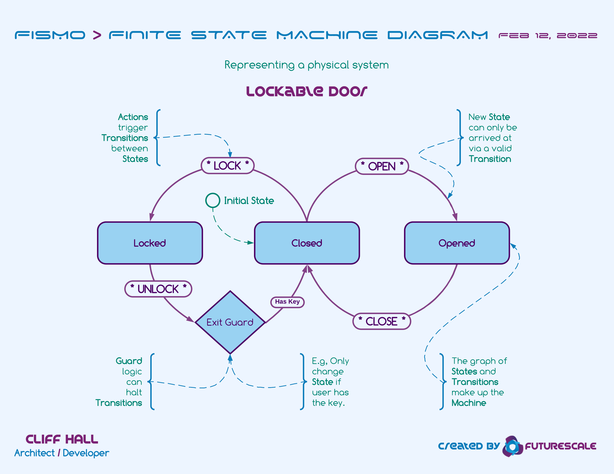
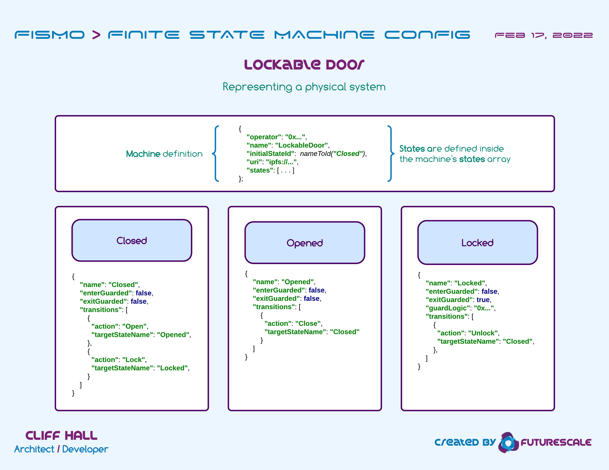

# [Status](README.md) 🧪 [About](about.md) 🧪 FAQ 🧪 [Docs](intro.md)

## Frequently Asked Questions
* [What is a finite state machine?](#what-is-a-finite-state-machine)
* [What can they usefully map to?](#what-are-state-machines-used-for)
* [What are some examples?](#what-are-some-examples)
* [How is Fismo different?](#how-is-fismo-different)
* [What's in a machine configuration?](#whats-in-a-fismo-machine-configuration)
* [What does Fismo.sol actually do?](#what-does-fismosol-actually-do)

### What is a finite state machine?
The Finite State Machine (FSM) is an abstract "machine" with various states and rules for moving between them. The primary features are:
- A finite number of _States_, represented in a directed graph. 
- The edge connecting one _State_ to another is a _Transition_.
- _Transitions_ between _States_ are initiated by _Actions_.
- _States_ can also have associated _Guard_ logic, triggered on _exit from_ or _entry to_ a _State_, which have the ability to halt a _Transition_.

### What are state machines used for?
As a software pattern, they are frequently used to map processes. A couple of common examples:
  * Software installation wizards; a series of forms or choices with validation rules controlling progress.
  * The myriad steps in a commercial home loan process, each of which has rules about moving to the next.

### What are some examples?
Practically anything that can be described with a directed graph could be modeled as an FSM. States can represent...
  * Rooms in an dungeon, which an adventurer wanders through, being met with challenges.
  * Positions in a tournament bracket.
  * A player's health, such as in hungry state, eating is required before moving to another state.
  * An object such as a door, which could be opened, closed, or locked.
  
#### Locking Door Example FSM 

### How is Fismo different?
Most FSM implementations are set up to track state for a single machine.
For instance, even though multiple people may interact with an FSM-based auction contract, it is the current state of 
the auction that's being tracked (pending, open, closed). What the users are allowed to do is based on the state of 
the machine. The user has no "state" to speak of.

Fismo flips all this on its head. It tracks the state of _each user in every machine they interact with_.

A Machine is a combination of static configuration and guard logic that governs the current state of a user on that machine.

One part is purely configuration...
  * A graph of _states_
  * Valid _transitions_ between states
  * The _actions_ that can trigger _transitions_

The other, much more interesting part is "guard code"...
  * Each state can have an entrance guard; a function that will be called when a user enters a state
  * Each state can have an exit guard; a function that will be called when a user exits a state
  * Passing out of one state and into another, then, could trigger zero through two functions
  * Guard code can do anything, but is so-called because it is a chance to revert the transaction
    - _An adventurer is chained to a post in the middle of the room_
      - They were chained there by a troll when they came into the room. (This happened in the entrance guard logic.)
      - The exit guard for the room can revert if the user's state for the machine representing the chain is "shackled".
      - Some action a user takes in that machine could switch them to the "unshackled" state.
      - Once unshackled, the user can attempt the transition to the other room again.
      - Now the exit guard lets the user pass, and _maybe_ the entrance guard to the next room does as well - who knows?

### What's in a Fismo Machine configuration?
* The address of an operator contract which is used to invoke actions.
  * Aside from allowing the owner of the contract to create or extend machines, Fismo defers all other access control to the implementer. 
  * Actions on a Fismo machine must be invoked by the specified operator contract.
  * This allows the implementer to include custom logic that filters who can interact with the machine, when, and under what conditions. For instance it could be used to enforce that all activity on a machine must occur between two times, or that all users must hold a specific token.
* Any number of discrete state definitions.
* The valid transitions to other states and the actions that trigger them.
* Whether proxied guard logic exists for exiting a state.
* Whether proxied guard logic exists for entering a state.
* An off-chain metadata URI for each machine that describes this machine configuration in JSON format.
    - Like NFT metadata, commonly stored on IPFS.
    - Can have images and longer descriptions than is financially feasible for casual building on-chain.

#### Locking Door Example FSM Configuration

### What does Fismo.sol actually do?
It is a combination of...
  - The Proxy pattern for executing guard logic in the context of the Fismo contract.
  - A registry of machines and users' states within them.
  - Orchestrator of all state transitions in all machines for all users.
  - A self-cloning [Minimal Proxy](https://eips.ethereum.org/EIPS/eip-1167) factory.

It maintains...
  * Configurations for any number of named machines
  * Current state in any number of machines for any number of wallet addresses
  * A history of each user's positions (machine and state)

It executes...
  * Actions that trigger user transitions between states
  * State-specific entrance and exit guard logic by delegating to logic contracts
    - This is similar to the facets of the [Diamond proxy pattern](https://eips.ethereum.org/EIPS/eip-2535).
    - Except, function signatures on Fismo's proxied logic contracts are...
      - Deterministic. Based on the machine and the states involved in a transition.
      - Guard function signatures look like this: 
        - `MachineName_StateName_Enter(address _user, string calldata _action, string memory _priorStateName)` 
        - `MachineName_StateName_Exit(address _user, string calldata _action, string memory _nextStateName)`.
      - Simpler to maintain while avoiding name collisions.

It emits events when...
  * A machine is created
  * A machine is modified
  * A state is added to an existing machine
  * A transition is added to an existing state
  * A state's definition is updated e.g., its guard logic contract is changed
  * A user transitioned to a new state in some machine
  * A user cloned the Fismo contract
  * Ownership is transferred

Typical revert reasons...
  * An added machine, state, or transition is misconfigured in some way
  * An address supplied for a guard logic contract has no code
  * Action invocation not called from declared operator address
  * Action invoked is not valid for the user's current state in the given machine
  * An exit guard function reverts during action invocation
  * An entrance guard function reverts during action invocation
  * Attempting to clone a clone

